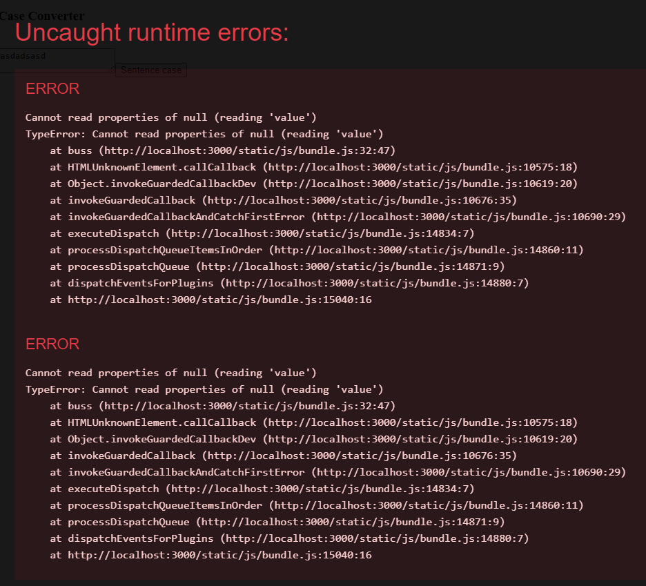

# Day 3

Module helps us breakdown our codes to multiple small codes.

`import message from "./message.js";`

ES Modules rely on the `import` and `export` statements.

```
const name = "Jesse"
const age = 40

export { name, age }
```

Ternary operators are if else statement but in a shortcut form. if == ? else == : 

Today I tried making a sentence case converter using React syntax format. There are some errors on the code but it seems like it needs useState hooks as per chatgpt.

Here is a screenshot of the error I got. 

